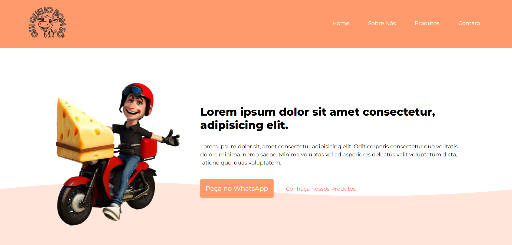

<h1 align="center"> Site - Qui Queijo Bom Sô</h1>

Site de loja de queijos 

---

 

  

---
## 💻 Tecnologias

Esse projeto foi desenvolvido com as seguintes tecnologias:

- HTML5
- CSS3
- Javascript
- Git e Github
- Formsubmit

---

## 🚧 Projeto

Este site foi criado como Freelance para a Empresa Qui Queijo Bom Sô, loja de queijos.
Este projeto possui Direitos de Copyright e não deve ser clonado, copiado ou modificado, sendo passivo de Ação de Direitos Autorais e Propriedade Intelectual. 

Você pode ver o site neste link: [Site Qui Queijo Bom Sô](https://nigerade.github.io/Projeto_QuiQueijoBomSo/)

--- 